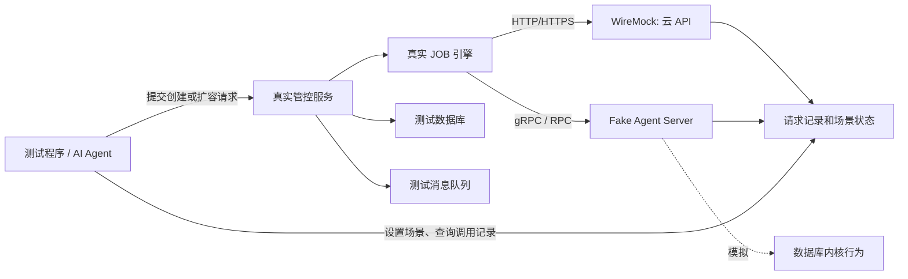

# 云数据库管控服务 Mock 测试方案

## 1. 背景与目标

当前系统属于云数据库的管控面。它负责接收创建、安装、扩容等业务请求，提交异步 JOB，并编排多个步骤完成资源交付。

典型流程包括：

1. 调用云厂商 API 购买或配置 ECS、EVS、VPC 等资源。
2. 在 ECS 上部署数据库镜像，镜像中包含数据库内核和节点侧管控服务（Agent）。
3. 管控面通过 RPC 调用节点 Agent。
4. 节点 Agent 操作数据库内核，执行安装、初始化、加入集群、扩容等动作。
5. 管控面轮询或接收执行结果，更新 JOB 和数据库实例状态。

当前痛点是：AI 自动修改代码后，无法在本地调用真实云资源和真实 ECS 节点完成验证，导致“修改代码 -> 自动测试 -> 根据结果继续修复”的开发闭环中断。

本方案目标是：在不真实购买云资源、不依赖真实节点的情况下，尽可能运行真实业务服务、真实 JOB 编排、数据库和消息队列，完成组件级集成测试。

## 2. 推荐总体方案

采用“真实管控服务 + 虚拟外部依赖”的方式：



外部依赖分为两类，建议分别处理：

| 外部依赖 | 协议 | 推荐 Mock 方式 |
|---|---|---|
| ECS、EVS、VPC 等云 API | HTTP/HTTPS | WireMock |
| ECS 上的节点管控服务 Agent | gRPC | WireMock gRPC 扩展或轻量 Fake gRPC Server |
| ECS 上的节点管控服务 Agent | Dubbo、Thrift、自定义 RPC | 按原协议实现 Fake Agent Server |
| 数据库内核 | 通常由 Agent 间接调用 | 第一阶段不直接 Mock，由 Fake Agent 模拟内核执行结果 |

不要强行把所有协议都塞进一个 WireMock。WireMock 的核心能力是 HTTP API 模拟；RPC 是否适用取决于具体协议。

## 3. 对当前思路的判断

“本地启动一个 Mock Server，让真实业务服务的所有外部请求指向它”是可行且常见的服务虚拟化方案，尤其适合以下测试：

- 创建数据库实例 JOB。
- ECS、EVS、网络等资源编排。
- 数据库安装流程。
- 新建 ECS 并加入现有集群的扩容流程。
- JOB 异步状态流转。
- 超时、重试、幂等和补偿。
- 某一步成功、后续步骤失败时的资源清理。
- Agent 调用失败或节点部分成功的处理。

它不能完全替代真实环境测试，因为以下内容仍需要在真实云或专用测试环境验证：

- 云账号鉴权、IAM 权限和签名兼容性。
- 云资源配额、库存和真实网络行为。
- 镜像是否真的能安装和启动数据库内核。
- Agent 与真实内核的兼容性。
- 云 SDK 与真实服务的细微协议差异。

因此建议采用两层验证：本地/CI 大量运行 Mock 组件测试，合入前或发布前运行少量真实环境冒烟测试。

## 4. 大量接口的输入输出从哪里获得

不建议一开始逐个阅读所有云接口文档并手写 Stub。应先从程序实际使用的接口出发，只模拟当前 JOB 能走到的调用。

### 4.1 从代码建立依赖清单

搜索云 SDK Client、Agent Client 和 RPC Stub 的调用点，形成清单：

| JOB 场景 | 调用方 | 接口/方法 | 关键请求字段 | 关键返回字段 |
|---|---|---|---|---|
| 创建实例 | 管控服务 | CreateEcs | 规格、镜像、可用区 | instanceId |
| 创建实例 | 管控服务 | CreateVolume | 类型、容量 | volumeId |
| 等待资源 | 管控服务 | DescribeEcs | instanceId | status、IP |
| 安装内核 | 管控服务 | Agent.Install | 节点、版本、配置 | taskId |
| 查询安装 | 管控服务 | Agent.QueryTask | taskId | state、error |
| 扩容 | 管控服务 | Agent.JoinCluster | 集群、节点信息 | result |

第一版只覆盖一个最重要的成功流程，例如“三节点数据库创建成功”，不要试图一次覆盖全部接口。

### 4.2 从 SDK 类型和协议定义获取结构

- 云 SDK：查看代码中使用的 Request/Response 类、SDK 调用日志和官方 API 文档。
- gRPC：`.proto` 文件就是最准确的请求、响应和服务方法契约。
- Dubbo/Java RPC：查看共享接口 JAR、DTO 和序列化协议。
- OpenAPI：如果外部服务提供 OpenAPI 文件，可以用它生成样例和校验响应结构。

Mock 响应不必填写真实响应中的所有字段，只需包含业务代码实际读取的字段。缺失字段也应有专项测试，用来发现代码是否错误依赖未保证的数据。

### 4.3 录制真实交互，再清洗为 Stub

WireMock 支持代理和 Record/Playback。可以在受控测试环境中让请求先经过 WireMock，再转发给真实 API，记录真实请求和响应并生成 Stub。

建议流程：

```text
业务服务 -> WireMock 录制代理 -> 真实测试环境 API
                         |
                         +-> 生成 mappings 和 response body
```

录制后必须进行清洗：

- 删除 AccessKey、Token、Cookie、签名和用户数据。
- 将账号 ID、IP、资源 ID 替换为测试值。
- 不要精确匹配时间戳、签名、随机 RequestId 等动态字段。
- 只保留决定业务分支的请求字段。
- 对资源 ID、任务 ID 使用响应模板或固定、可预测的测试值。

如果公司安全规则不允许录制云 API，可在测试环境打开 SDK HTTP 日志，或在测试代码中序列化 Request/Response 对象，获得相同的基础素材。

### 4.4 用请求日志反向补齐 Stub

当请求没有匹配 Stub 时，不要猜测。查看 WireMock 的请求日志：

```http
GET /__admin/requests
```

根据真实业务服务发出的 URL、Query、Header 和 Body 编写匹配规则。这样可以逐步完成：

```text
启动 JOB -> 发现第一个未匹配请求 -> 增加 Stub
         -> 再运行 -> 发现下一个请求 -> 增加 Stub
         -> 直到完整流程跑通
```

这套增量方式很适合 AI：AI 可以读取未匹配请求、已有 Stub、JOB 错误和日志，然后自动补充 Mock 数据或修复业务代码。

## 5. WireMock 的具体职责

WireMock 用于模拟所有 HTTP/HTTPS 云接口，并提供以下能力：

- 根据 Method、URL、Query、Header、JSON/XML Body 匹配请求。
- 返回 JSON、XML、Header 和不同 HTTP 状态码。
- 设置固定延迟、超时、断连和错误响应。
- 记录收到的请求，用于验证调用次数和参数。
- 使用 Scenario 模拟资源状态变化。
- 使用 Response Template 动态返回资源 ID 等数据。
- 代理并录制真实 HTTP 交互。

例如创建 ECS 后轮询状态，可以设计为：

```text
CreateEcs       -> 返回 i-mock-001
DescribeEcs #1 -> CREATING
DescribeEcs #2 -> CREATING
DescribeEcs #3 -> RUNNING，并返回 10.0.0.11
```

扩容场景可以返回多个新节点：

```json
{
  "instanceIds": ["i-mock-004", "i-mock-005"],
  "privateIps": ["10.0.0.14", "10.0.0.15"]
}
```

具体字段必须以实际云 SDK 期待的响应格式为准，包括 JSON/XML、字段命名和错误结构。

## 6. WireMock 能否模拟 RPC

答案取决于“RPC”具体是什么协议。

### 6.1 如果 Agent 使用 gRPC

WireMock 有 gRPC 扩展，可以读取由 `.proto` 生成的 descriptor，将 gRPC 消息转换为 JSON 后复用 WireMock 的匹配、模板和响应能力。因此从能力上可以模拟 gRPC。

但该扩展仍处于较活跃的演进阶段。第一版 PoC 应先验证你们是否使用以下能力：

- 普通 Unary RPC。
- Client/Server Streaming。
- 双向流。
- Metadata、自定义错误和 Deadline。

如果主要是 Unary RPC，可以直接尝试 WireMock gRPC 扩展。如果大量使用流式调用、复杂 Metadata 或自定义拦截器，建议建立一个 Java Fake gRPC Server，直接复用项目的 `.proto` 生成代码，通常更容易调试，也更接近真实 Agent。

### 6.2 如果 Agent 使用 Dubbo、Thrift 或自定义 RPC

WireMock 不能直接模拟这些协议。推荐新增独立的 `fake-agent-server`：

```text
fake-agent-server
├── 复用正式 RPC 接口/IDL
├── 实现 Install、QueryTask、JoinCluster 等方法
├── 支持场景配置
├── 保存调用记录
└── 返回成功、失败、超时和状态序列
```

Fake Agent 是测试基础设施，不应放进生产业务分支，也不应该通过 `if (mockEnabled)` 混入正式实现。

## 7. 建议的 Mock 工程结构

可以建立一个独立仓库或测试模块：

```text
cloud-db-mock-environment/
├── docker-compose.yml
├── wiremock/
│   ├── mappings/
│   │   ├── ecs/
│   │   ├── evs/
│   │   └── vpc/
│   └── __files/
├── fake-agent-server/
│   ├── src/
│   └── scenarios/
├── scenarios/
│   ├── create-success.json
│   ├── create-ecs-failed.json
│   ├── install-timeout.json
│   └── scale-out-partial-failure.json
└── tests/
    ├── create-database-test.*
    └── scale-out-test.*
```

如果希望统一操作体验，可以在 WireMock 和 Fake Agent 前面加一个很薄的“测试控制服务”，但不要重新实现 WireMock：

```http
POST /test/reset
POST /test/scenarios/create-success
POST /test/scenarios/install-timeout
GET  /test/requests
GET  /test/state
```

它只负责加载场景、重置状态和聚合调用记录。

## 8. 生产代码如何保持干净

生产代码允许存在的改动：

- 云 API Endpoint 外部化配置。
- Agent RPC 地址或服务发现地址可配置。
- 超时、重试参数可配置。
- 外部调用集中在 Client/Gateway 层。
- 为 JOB 提供可查询的状态、错误码和操作日志。

生产代码中不应该出现：

```java
if (mockEnabled) {
    return fakeResult;
}
```

建议配置：

```yaml
# application-autotest.yml
cloud:
  ecs-endpoint: http://wiremock:8080
  evs-endpoint: http://wiremock:8080
  vpc-endpoint: http://wiremock:8080

agent:
  endpoint: fake-agent:9090
```

生产环境使用真实地址，测试环境使用容器服务名。还应在自动测试网络中禁止访问公网，防止配置错误时购买真实资源。

## 9. 场景设计

不要只实现“全部成功”。第一阶段建议准备以下场景：

| 场景 | 云 API | Agent | 预期结果 |
|---|---|---|---|
| 创建成功 | ECS/EVS/VPC 成功 | 安装成功 | JOB 成功，实例可用 |
| ECS 创建失败 | 返回云错误 | 不调用 | JOB 失败，无残留资源 |
| ECS 长时间创建中 | 持续 CREATING | 不调用 | JOB 超时或重试 |
| 安装失败 | 云资源成功 | Install 失败 | JOB 失败并触发清理/标记 |
| 安装超时 | 云资源成功 | Agent 超时 | 重试次数符合预期 |
| 扩容成功 | 创建新节点成功 | JoinCluster 成功 | 新节点加入实例 |
| 扩容部分失败 | 两台成功、一台失败 | 部分加入失败 | 状态、补偿符合设计 |
| 重复提交 | 返回相同或已存在资源 | 幂等响应 | 不重复创建资源 |

每个场景都应该断言三类结果：

1. JOB 最终状态和错误信息。
2. 数据库中的实例、节点和资源记录。
3. WireMock/Fake Agent 收到的调用次数、顺序和关键参数。

## 10. AI 自动开发闭环

目标不是只让 AI 运行单元测试，而是给 AI 一个可重复控制的完整环境：

```text
1. docker compose up -d
2. 重置 Mock 状态
3. 加载测试场景
4. 启动或重启真实业务服务
5. 调用业务 API 提交 JOB
6. 轮询 JOB 到成功/失败终态
7. 查询数据库和调用记录
8. 生成断言结果
9. AI 根据失败日志修改代码
10. 重新执行
```

为了让 AI 容易使用，所有步骤应封装为少量稳定命令，例如：

```powershell
./dev-env.ps1 start
./dev-env.ps1 scenario create-success
./dev-env.ps1 test create-database
./dev-env.ps1 logs
./dev-env.ps1 stop
```

命令应返回非零退出码表示失败，并输出结构化 JSON 测试报告，避免 AI 只能分析大量散乱日志。

## 11. 公司内 PoC 建议

第一阶段不要直接建设完整 Mock 平台。建议用 2 到 5 天验证一个最小闭环：

1. 选择一个最短、最重要的 JOB，例如创建单节点或最小规格数据库。
2. 列出这个 JOB 实际调用的云 API 和 Agent RPC。
3. 用 Docker 启动 WireMock，只模拟这些云 API。
4. 如果 Agent 是 gRPC Unary，尝试 gRPC 扩展；否则写最小 Fake Agent。
5. 让真实业务服务的 Endpoint 指向本地 Mock。
6. 跑通一次成功流程。
7. 增加一个云 API 失败和一个 Agent 超时场景。
8. 验证 AI 能否独立执行测试并根据结果修改代码。

PoC 的通过标准：

- 一条命令启动全部测试依赖。
- 不访问真实云、不创建真实资源。
- 创建 JOB 能进入确定的成功终态。
- 至少两个失败场景能稳定复现。
- 能验证云 API 和 Agent 的调用参数及次数。
- 环境重置后重复执行结果一致。
- AI 能读取结果并完成“修改 -> 测试 -> 再修改”的闭环。

## 12. 后续治理

PoC 成功后，再逐步增加以下能力：

- 为 Stub 和正式代码建立版本对应关系。
- 使用 OpenAPI、`.proto` 或共享 DTO 做契约校验。
- 从真实测试环境定期更新脱敏样本。
- 在 CI 中为每次测试启动独立 Mock 实例，避免共享状态污染。
- 对 Stub 增加所有者、来源、更新时间和适用版本元数据。
- 保留少量真实云冒烟测试，检测 Mock 与真实服务的漂移。

## 13. 扩容测试的前置集群如何准备

### 13.1 先明确测试边界

扩容测试的前置条件是“已有一个处于 READY 状态的集群”。对扩容责任点的组件测试而言，安装流程属于上游能力，不需要每次测试都重新执行。

因此应把测试拆成两类：

| 测试类型 | 前置集群来源 | 用途 | 执行频率 |
|---|---|---|---|
| 扩容组件测试 | 恢复一个模拟的 READY 集群 | 快速验证扩容 JOB、状态和异常处理 | 本地、每次提交 |
| 安装后扩容端到端测试 | 先执行真实安装流程，再执行扩容 | 验证安装与扩容之间的真实衔接 | 少量、定时或发布前 |

这属于常见的测试分层做法：大量快速测试隔离上游依赖，少量较慢测试覆盖完整业务链路。不能只保留第一类，否则无法发现安装阶段写入的数据与扩容阶段读取的数据不兼容；也不应让所有扩容测试依赖完整安装，否则测试会慢、脆弱且难以定位问题。

### 13.2 推荐使用真实数据库加可恢复的集群 Fixture

测试时继续使用与生产相同类型的真实数据库，但数据库中存放的是测试集群数据。云资源和节点 Agent 则由 WireMock/gRPC Mock 模拟。

```text
真实测试数据库：集群、实例、节点、任务、资源关系等记录
WireMock：模拟已有 ECS/EVS/VPC 和扩容时新建资源
gRPC Mock：模拟已有节点状态、安装新节点、加入集群等行为
```

模拟集群不等于只在一张集群表中插入一条记录。它必须满足扩容代码实际依赖的业务不变量，例如：

- 集群状态是 READY/RUNNING。
- 原有三个节点都处于正常状态。
- 节点与 ECS、磁盘、网络资源的关联完整。
- 集群版本、规格、可用区和拓扑信息齐全。
- 不存在未完成的冲突 JOB。
- Agent 地址或服务发现信息能指向 gRPC Mock。

### 13.3 不建议长期手写一大段散乱 SQL

PoC 阶段可以用 SQL 快速建立最小数据，但复杂项目中，纯手写 SQL 很容易遗漏表、默认值和状态约束。优先级建议如下：

1. **首选：测试数据构造器（Fixture Builder）**。通过项目的 Repository/DAO 或专用测试构造代码创建一个合法集群，集中维护默认值和关联关系。
2. **现实可行：脱敏数据库快照**。在测试环境成功安装一次三节点集群，导出与该集群相关的数据，脱敏后作为基线；每次扩容测试前恢复快照。
3. **过渡方案：版本化 SQL Fixture**。把 SQL 放入测试工程并跟随数据库迁移更新，不允许开发者各自保存一份临时 SQL。
4. **少量使用：调用正式安装业务准备数据**。仅用于完整端到端测试，不作为每个扩容测试的固定前置步骤。

如果当前表很多、关系复杂，而且缺少稳定的数据构造接口，建议 PoC 先采用“脱敏快照 + 少量参数替换”。它通常比从零手写所有 SQL 更快、更接近真实安装结果。后续再把快照逐步收敛成可维护的 Fixture Builder。

### 13.4 推荐的扩容测试流程

以“三节点扩容到六节点”为例：

```text
1. 创建空测试数据库并执行最新数据库迁移
2. 恢复三节点 READY 集群 Fixture
3. 重置 WireMock 和 gRPC Mock
4. 配置原有三个节点正常可用
5. 配置云 API 可创建三个新 ECS/磁盘
6. 配置新节点 Agent 安装和 JoinCluster 成功
7. 调用真实管控面扩容 API
8. 等待真实扩容 JOB 进入终态
9. 验证数据库中节点从 3 个变成 6 个
10. 验证云 API 创建次数、参数和幂等键
11. 验证 gRPC 的安装、加入集群调用及顺序
12. 销毁或回滚测试数据库，保证下次可重复执行
```

随后增加独立失败场景，例如第二台 ECS 创建失败、第三个节点安装超时、JoinCluster 部分成功、JOB 重试后重复调用，以及补偿清理失败。

### 13.5 快照不能成为黑盒

数据库快照适合快速起步，但需要治理：

- 快照必须由最新数据库迁移能够恢复或升级。
- 记录快照来源、对应版本、集群拓扑和生成方式。
- 清除租户信息、凭据、真实 IP 和云资源 ID。
- 每个测试使用独立数据库/schema，或测试前完整重置。
- 为 Fixture 增加健康检查，测试开始前验证关键表和关联关系。
- 最终断言应关注业务状态，不要过度依赖所有表的每个字段完全不变。

### 13.6 gRPC Mock 的具体建议

既然节点侧管控服务使用 gRPC，可以先尝试 WireMock gRPC 扩展。它读取由 `.proto` 生成的 descriptor，把 Protobuf 消息转换为 JSON 做匹配，再将 JSON 响应转换回 Protobuf。

PoC 建议只选择扩容流程中的一个 Unary RPC，例如 `InstallNode` 或 `JoinCluster`：

1. 找到正式 `.proto` 文件和目标 RPC 方法。
2. 生成 descriptor 文件并放入 WireMock 的 `grpc` 目录。
3. 配置一个成功响应和一个 gRPC 非 OK 响应。
4. 将业务服务的 gRPC Target 指向本地 WireMock。
5. 验证 Deadline、Metadata、状态码和请求字段是否满足现有客户端。

如果你们大量使用双向流、复杂拦截器、服务发现或双向 TLS，直接实现复用正式 `.proto` 的 Java Fake gRPC Server 往往更容易维护。WireMock gRPC 扩展适合先做验证，不必在 PoC 前就确定它必须承载所有 Agent 行为。

## 14. 最终建议

整体方向是正确的：使用独立 Mock 环境替代外部云资源和 ECS 节点依赖，能够显著提高本地开发、AI 自动编码和 CI 测试效率。

推荐最终组合为：

```text
HTTP 云 API                -> WireMock
gRPC Agent（简单 Unary）   -> 先验证 WireMock gRPC 扩展
复杂 gRPC/其他 RPC Agent   -> Java Fake Agent Server
真实业务、JOB、DB、MQ       -> 尽量保持真实
少量端到端验证              -> 真实测试云环境
```

最关键的实施原则是：从一个真实 JOB 的最小成功链路开始，根据程序实际发出的请求增量补齐 Stub，而不是先手工模拟所有外部接口。

## 参考资料

- [WireMock Standalone](https://wiremock.org/docs/standalone/)
- [WireMock Docker](https://wiremock.org/docs/standalone/docker/)
- [WireMock Stubbing](https://wiremock.org/docs/stubbing/)
- [WireMock Record and Playback](https://wiremock.org/docs/record-playback/)
- [WireMock Request Verification](https://wiremock.org/docs/verifying/)
- [WireMock gRPC Extension](https://github.com/wiremock/wiremock-grpc-extension)
